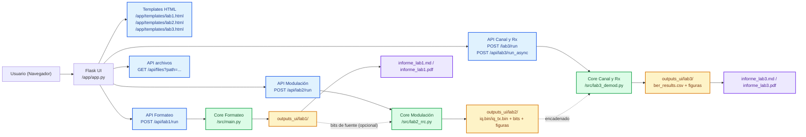

# Proyecto CDA - Etapas del Sistema de Transmisión

Este repositorio integra los pipelines de procesamiento para la materia **Comunicación Digital Avanzada**. Incluye una **interfaz web Flask** unificada para ejecutar y visualizar las tres etapas de la cadena Tx/Rx:

*   **Formateo**: Muestreo/re-muestreo, cuantización (Uniforme/$\mu$-law), codificación binaria y scrambling.
*   **Modulación**: Mapeo de símbolos (BPSK/QPSK), sobremuestreo y filtro conformador de pulso RRC.
*   **Canal y Rx**: Canal AWGN, filtro acoplado, muestreo óptimo, decisión ML/MAP y estimación de BER.

---

## 🚀 Guía de Inicio Rápido (De cero)

Sigue estos pasos para instalar y correr el proyecto en tu sistema local.

### 1. Prerrequisitos
*   **Python 3.10** o superior.
*   **Git** (opcional, para clonar).

### 2. Instalación

Se recomienda encarecidamente usar un **entorno virtual** para evitar conflictos de dependencias.

#### Paso 1: Clonar o descargar el código
Si tienes git:
```bash
git clone <url-del-repo>
cd cda
```
O simplemente descomprime el archivo ZIP en una carpeta.

#### Paso 2: Crear y activar entorno virtual
En la terminal (dentro de la carpeta del proyecto):

**macOS / Linux:**
```bash
python3 -m venv .venv
source .venv/bin/activate
```

**Windows (PowerShell):**
```powershell
python -m venv .venv
.venv\Scripts\Activate.ps1
```

#### Paso 3: Instalar dependencias
```bash
pip install -r requirements.txt
```

---

## 🖥️ Ejecución de la Aplicación Web

La forma más fácil de interactuar con el proyecto es mediante la aplicación web incluida.

1.  Asegúrate de tener el entorno virtual activado.
2.  Ejecuta el servidor:
    ```bash
    # Opción A (Puerto por defecto 5001)
    python app/app.py

    # Opción B (Especificar otro puerto)
    PORT=5000 python app/app.py
    ```
3.  Abre tu navegador (Chrome, Firefox, Safari) e ingresa a:
    *   **http://127.0.0.1:5001/** (o el puerto que hayas configurado).

Verás el menú principal con acceso a las tres etapas.

---

## 🧪 Descripción de las Etapas

### Formateo
Convierte señales analógicas (audio) o texto a un flujo de bits digital.
*   **Features**: Cuantización ajustable (bits, $\mu$) y aleatorización (Scrambling).
*   **Salida**: Gráficos de histogramas de bits, evolución de entropía, comparativas de SQNR/MSE.

### Modulación: Transmisor Digital
Toma una secuencia de bits (o genera una aleatoria) y simula la etapa de transmisión.
*   **Features**: Modulaciones BPSK/QPSK, Filtro RRC con *roll-off* ($\alpha$) variable, sobremuestreo (SPS).
*   **Salida**: Diagrama de Constelación (Tx), Ojo, Espectro, y archivos `.bin` (IQ flotante) para SDR.

### Canal y Rx: Receptor y Canal
Simula el canal de comunicaciones y la etapa de recepción.
*   **Features**: Canal AWGN (ruido gaussiano), Filtro Acoplado (Matched Filter), estimación de BER vs Eb/N0.
*   **Modos**:
    *   **Curva BER**: barre valores de Eb/N0 para generar la curva experimental y compararla con la teórica.
    *   **Punto de operación**: se obtiene fijando `Eb/N0 mínimo = Eb/N0 máximo`; así se calcula un único valor de `P_b`.
    *   **Integración**: toma la salida real de Modulación (`iq.bin`/`iq_tx.bin` + bits) para verificar la transmisión completa.

---

## 🔗 Flujo Encadenado Recomendado (Entrega)

Para cumplir el enfoque de la entrega, ejecutar en este orden:

1. `Formateo`: generar bits de fuente (audio/texto), métricas y gráficos.
2. `Modulación`: usar bits de Formateo para generar señal IQ (`iq.bin`/`iq_tx.bin`) y guardar parámetros.
3. `Canal y Rx`: usar la salida real de Modulación (`iq.bin`/`iq_tx.bin` + bits) para:
   - inyectar AWGN,
   - aplicar filtro acoplado,
   - detectar símbolos (ML/MAP),
   - calcular BER y curva BER vs Eb/N0.

Este encadenamiento evita una simulación aislada y mantiene la trazabilidad del sistema completo.

### Nota sobre Eb/N0 y P_b

En la etapa **Canal y Rx**, el usuario sí define el **Eb/N0** de simulación. El proyecto usa ese valor para:

1. agregar AWGN a la señal IQ transmitida,
2. demodular la señal recibida,
3. comparar bits transmitidos contra bits detectados,
4. calcular la **probabilidad de error de bit experimental** `P_b = BER`.

Además, el repositorio calcula la **curva teórica** para BPSK/QPSK con:

`P_b = 0.5 * erfc(sqrt(Eb/N0))`

Por eso la salida de `Canal y Rx` incluye simultáneamente:

- `ber_results.csv`: BER experimental, BER teórica, banda de confianza e `Eb/N0` estimado,
- `ber_curve.png`: comparación gráfica entre curva simulada y curva teórica.

La opción **Muestras Monte Carlo por Eb/N0** indica cuántas veces se repite la simulación para cada punto del barrido. Más muestras estabilizan la curva, pero incrementan el tiempo de cómputo.

---

## 📡 Arquitectura del Sistema de Transmisión (DSP)

```mermaid
flowchart LR
    classDef l1 fill:#fee2e2,stroke:#dc2626,stroke-width:2px,color:#7f1d1d
    classDef l2 fill:#dcfce7,stroke:#16a34a,stroke-width:2px,color:#14532d
    classDef ch fill:#ffedd5,stroke:#ea580c,stroke-width:2px,color:#7c2d12
    classDef l3 fill:#f5f5f5,stroke:#111827,stroke-width:2px,color:#111827
    classDef eval fill:#eef2ff,stroke:#4338ca,stroke-width:2px,color:#312e81

    subgraph L1["Formateo: Fuente Digital"]
        direction TB
        S1["Fuente de información<br/>(Audio/Texto)"] --> S2["Muestreo + Cuantización<br/>(Uniforme o µ-law)"]
        S2 --> S3["Codificación / Ecualización<br/>(Scrambling)"]
        S3 --> S4["Bits de salida (Rb)"]
    end

    subgraph L2["Modulación: Transmisor Digital"]
        direction TB
        T1["Mapeo de símbolos<br/>(BPSK / QPSK)"] --> T2["Sobremuestreo (sps)"]
        T2 --> T3["Pulso conformador RRC Tx<br/>(alpha, span)"]
        T3 --> T4["Señal IQ transmitida s(t)"]
    end

    subgraph CH["Canal"]
        direction TB
        C1["Canal AWGN<br/>r(t)=s(t)+n_AWGN(t)"]
    end

    subgraph L3["Canal y Rx: Receptor / Detector"]
        direction TB
        C2["Señal recibida r(t)"] --> R1["Filtro acoplado RRC Rx"]
        R1 --> R2["Muestreo óptimo + sincronía de símbolo"]
        R2 --> R3["Detector Bayesiano<br/>(ML/MAP)"]
        R3 --> R4["Bits reconstruidos"]
    end

    E1["Evaluación BER vs Eb/N0<br/>(curva simulada vs teórica)"]:::eval

    S4 --> T1
    T4 --> C1
    C1 --> C2
    R4 --> E1
    S4 -. "Bits de referencia" .-> E1

    class S1,S2,S3,S4 l1
    class T1,T2,T3,T4 l2
    class C1 ch
    class C2,R1,R2,R3,R4 l3
```



Este bloque muestra la arquitectura funcional de la cadena Tx/Rx que implementa el proyecto y la métrica final (BER).

---

## 🏗️ Arquitectura de Software (Web + DSP)



Este diagrama refleja la arquitectura real del repo: Flask orquesta, `src/` procesa DSP y `outputs_ui/` conserva trazabilidad por corrida.

---

## ✅ Matriz de Cumplimiento (Guía de Informe)

La siguiente tabla indica qué pide la guía y dónde queda evidenciado en el proyecto.

| Requisito de la guía | Estado | Evidencia / archivo |
|---|---|---|
| Descripción teórica y diagrama de bloques del sistema | Parcial (plantilla + README) | `README.md`, `docs/articulo_lab3_template.md`, `docs/presentacion_lab3_template.md` |
| Implementación Python/Colab del sistema completo | Cumple | `src/main.py`, `src/lab2_rrc.py`, `src/lab3_demod.py`, `app/app.py` |
| Señal original en tiempo y/o espectro | Cumple | Salidas Formateo y Modulación en `outputs_ui/...` |
| Histograma de amplitudes (antes del formateo) | Cumple | Formateo: `A_signal_hist.png` |
| Histogramas de bits antes/después ecualización | Cumple | Formateo: `A_bits_*`, `B_bits_*` |
| Evolución de entropía | Cumple | Formateo: `*_entropy_evolution*.png` |
| Señal IQ en tiempo (I/Q) | Cumple | Modulación: `iq_time.png`, Canal y Rx: `rx_time.png` |
| Espectro de potencia | Cumple | Modulación: `spectrum.png` |
| Constelación de símbolos | Cumple | Modulación/3: `constellation.png`, `rx_constellation.png` |
| Forma del pulso RRC y respuesta temporal | Cumple | Modulación: `rrc_impulse.png` |
| Constelaciones antes y después del canal | Cumple | Canal y Rx: `tx_rx_constellations.png` |
| Respuesta impulsiva y en frecuencia del filtro acoplado | Cumple | Canal y Rx: `mf_impulse.png`, `mf_freq.png` |
| Salida del filtro acoplado y decisión MAP/ML | Cumple | Canal y Rx: `rx_decision.png` |
| Curva Pb(Eb/N0) experimental vs teórica | Cumple | Canal y Rx: `ber_curve.png`, `ber_results.csv` |
| Discusión crítica | Parcial (plantilla) | `informe_lab3.md` + plantillas en `docs/` |
| Presentación PowerPoint | Parcial (plantilla) | `docs/presentacion_lab3_template.md` |
| Artículo técnico IEEE/APA | Parcial (plantilla) | `docs/articulo_lab3_template.md` |

Notas:
- `Cumple`: se genera automáticamente por pipeline.
- `Parcial`: hay base/plantilla, pero requiere redacción final del grupo.

---

## 🧭 Cobertura del Informe (Automático vs Manual)

### Generado automáticamente por el proyecto
- **Formateo**: `informe_lab1.md`, `informe_lab1.pdf`, histogramas, entropía, SQNR/MSE.
- **Modulación**: `iq.bin`/`iq_tx.bin`, `bits.bin`/`bits_tx.bin`, `params.json`, `iq_time.png`, `constellation.png`, `spectrum.png`, `rrc_impulse.png`, `eye_diagram.png`.
- **Canal y Rx**: `ber_curve.png`, `ber_results.csv`, `rx_time.png`, `rx_eye.png`, `rx_constellation.png`, `tx_rx_constellations.png`, `mf_impulse.png`, `mf_freq.png`, `rx_decision.png`, `informe_lab3.md`, `informe_lab3.pdf`.

### Requiere completar manualmente para la entrega
- Redacción final de **discusión técnica y conclusiones** (interpretación crítica de resultados).
- **Presentación** final usando `docs/presentacion_lab3_template.md`.
- **Artículo técnico** final usando `docs/articulo_lab3_template.md`.
- Ajuste de formato institucional (portada, autores, bibliografía, estilo de cátedra).

---

## 🔎 Checklist de Validación Pre-Entrega

Después de correr Formateo -> Modulación -> Canal y Rx, verificar:

1. En `outputs_ui/lab2/<timestamp>/` existan `iq.bin`/`iq_tx.bin` y `bits_formateo.bin` (alias `bits_from_lab1.bin`) o `bits.bin`.
2. En `outputs_ui/lab3/<timestamp>/` exista `ber_results.csv` y la curva `ber_curve.png`.
3. En `outputs_ui/lab3/<timestamp>/` estén las figuras de receptor: `rx_eye.png`, `rx_constellation.png`, `rx_decision.png`.
4. En `outputs_ui/lab3/<timestamp>/` estén `informe_lab3.md` e `informe_lab3.pdf`.
5. La tabla de `ber_results.csv` muestre columnas de `BER_Sim`, `BER_Theory`, `BER_CI95_MonteCarlo`, `EbN0_Est_Mean_dB`.

Si se cumple el checklist, el repositorio cubre los requisitos técnicos medibles del informe; solo resta la redacción final del equipo.

---

## 🧾 Informes Automáticos

### Formateo
- `informe_lab1.md`
- `informe_lab1.pdf`

### Canal y Rx
- `informe_lab3.md`
- `informe_lab3.pdf`

Se generan en la carpeta de salida de cada corrida (`outputs_ui/labX/<timestamp>/`).

### Informe del alumno incluido en el repo
- `docs/informes/CorantiElias_CDA.pdf`

---

## 📦 Entregables del Proyecto (qué exportar)

Para armar la entrega final, exportar:

1. Carpeta de resultados de Formateo (`outputs_ui/lab1/<timestamp>/`).
2. Carpeta de resultados de Modulación (`outputs_ui/lab2/<timestamp>/`).
3. Carpeta de resultados de Canal y Rx (`outputs_ui/lab3/<timestamp>/`), incluyendo:
   - `ber_curve.png`
   - `ber_results.csv`
   - `informe_lab3.md`
   - `informe_lab3.pdf`
4. Presentación final basada en `docs/presentacion_lab3_template.md`.
5. Artículo final basado en `docs/articulo_lab3_template.md`.

---

## ⌨️ Ejecución vía Consola (CLI)

Si prefieres usar la línea de comandos para scripts automatizados:

**Formateo:**
```bash
python -m src.main --audio data/voice.wav --n_bits 8 --quantizer mulaw --out outputs/cli_lab1
```

**Ayuda:**
```bash
python -m src.main -h
```

---

## 📂 Estructura de Archivos

*   `app/`: Código de la aplicación web (Flask) y templates HTML.
*   `src/`: Librerías core de procesamiento DSP.
    *   `main.py`: Lógica Formateo.
    *   `lab2_rrc.py`: Lógica Modulación.
    *   `lab3_demod.py`: Lógica Canal y Rx.
*   `data/`: Archivos de entrada de ejemplo (audio, texto).
*   `outputs_ui/`: Carpeta donde se guardan los resultados de las corridas web (organizados por fecha).
*   `docs/`: Plantillas y entregables documentales:
    * `docs/presentacion_lab3_template.md` (estructura PowerPoint)
    * `docs/articulo_lab3_template.md` (estructura IEEE/APA)
    * `docs/informes/CorantiElias_CDA.pdf` (informe final del alumno)
