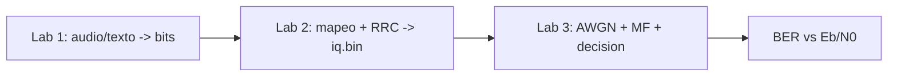

# Plantilla de Presentación (Lab 3)

Esta plantilla está pensada para una exposición de **35 a 45 minutos**.
Usá las figuras generadas en la corrida de Lab 3 (`outputs_ui/lab3/<timestamp>/`).

## Slide 1 - Portada
- Título: *Demodulación Digital: AWGN, Filtro Acoplado y Estimación Bayesiana*
- Materia, comisión, integrantes, fecha.

## Slide 2 - Objetivos
- Emular canal AWGN sobre IQ de Lab 2.
- Implementar receptor: MF + muestreo + ML/MAP.
- Obtener BER experimental vs teórica.
- Analizar trade-offs (BW, ISI, complejidad).

## Slide 3 - Contexto y Encadenamiento Lab 1 -> Lab 2 -> Lab 3

- Remarcar: curva BER se calcula sobre salida real de Lab 2.

## Slide 4 - Modelo del Sistema
- Ecuación del canal: `r[n] = s[n] + w[n]`.
- Filtro acoplado: réplica temporal del pulso Tx.
- Decisión ML/MAP por umbral (BPSK/QPSK).

## Slide 5 - Parámetros de Simulación
- Modulación: [...]
- `sps`: [...]
- `alpha`: [...]
- `span`: [...]
- Rango `Eb/N0`: [...]
- Trials Monte Carlo por punto: `20` o `50`.

## Slide 6 - Señal Transmitida (Lab 2)
- Insertar: `iq_time.png`, `spectrum.png`, `constellation.png`, `eye_diagram.png`.
- Comentario corto de calidad de la señal Tx.

## Slide 7 - AWGN y Estimación de Eb/N0
- Mostrar fórmula:
  - `Ps = mean(|s|^2)`
  - `Pn = mean(|n|^2)`
  - `SNR = Ps/Pn`
  - `Eb/N0 = SNR * sps / k`
- Explicar diferencia entre `Eb/N0 objetivo` y `Eb/N0 estimado`.

## Slide 8 - Filtro Acoplado
- Insertar: `mf_impulse.png`, `mf_freq.png`.
- Explicar por qué maximiza SNR en el instante de decisión.

## Slide 9 - Señal Recibida y Muestreo
- Insertar: `rx_time.png`, `rx_eye.png`.
- Relación apertura del ojo vs BER.

## Slide 10 - Decisión ML/MAP
- Insertar: `rx_decision.png`, `rx_constellation.png`.
- Umbral y reconstrucción de bits.

## Slide 11 - Constellaciones Tx vs Rx
- Insertar: `tx_rx_constellations.png`.
- Comentar dispersión según Eb/N0.

## Slide 12 - Curva BER (resultado principal)
- Insertar: `ber_curve.png`.
- Describir:
  - Curva teórica.
  - Curva simulada.
  - Banda IC95 (Monte Carlo).

## Slide 13 - Tabla de Resultados
- Tabla resumida desde `ber_results.csv`:
  - `EbN0_Target_dB`
  - `BER_Sim`
  - `BER_Theory`
  - `BER_CI95_MonteCarlo`
  - `EbN0_Est_Mean_dB`

## Slide 14 - Trade-offs y Discusión
- `alpha` bajo/alto: BW vs colas.
- `sps` y `span`: precisión vs costo computacional.
- Diferencias teoría/simulación y causas.

## Slide 15 - Conclusiones y Trabajo Futuro
- Conclusiones técnicas.
- Mejoras: sincronización fina de fase/frecuencia, canal selectivo, ecualización adaptativa.
- Preguntas.

---

## Checklist antes de presentar
- [ ] Todas las figuras se leen bien (fuente > 20 pt).
- [ ] Unidades y ejes visibles.
- [ ] Curva BER con leyenda clara.
- [ ] Tabla resumida con valores finales.
- [ ] Mensaje final de conclusiones en 3 bullets.

